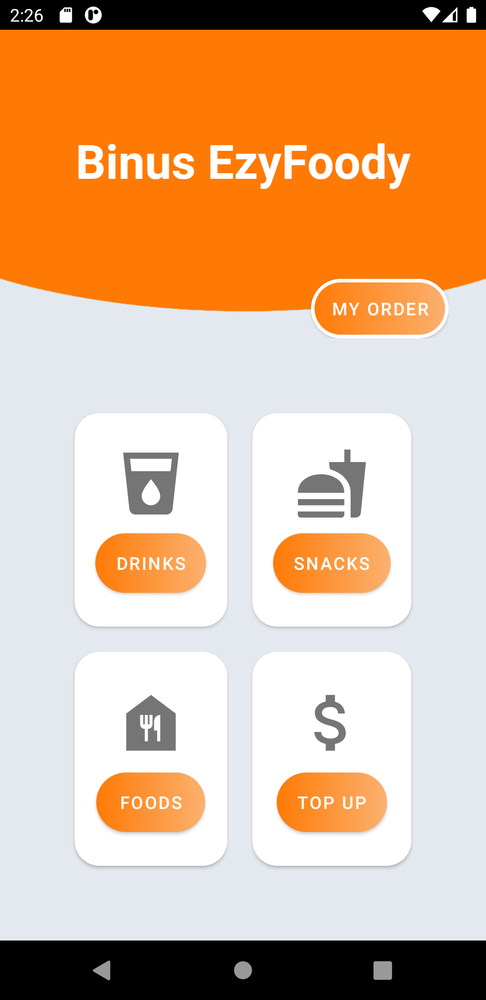

# binusEzyFood-App

This is my final result for **BINUS Mid Exam on Mobile Programming subject (MOBI6059)** (5th Semester). I rushed myself and managed to finish the exam in about 2.5 days by exploring videos on youtube and read several books related. The UI is a bit off but I will refine them once I've had enough time.

Our exam is to create an app that can **store, add, and delete data temporarily**, so we didn't need to implement any SQLDatabase related. Moreover, we had to implement **Recyclver View** to make the data displayed dynamicaly.

## Main Points

The main points are the user can:
- **Choose items based on the list-item displayed using Recycler View**
- **Add items to the temporary Cart**
- **Delete items in the Cart**
- **Getting displayed the total price of quantity x Item's Base Price in the Cart Section**

## Notes

I also added validation for the apps as so:
- **If users add items that has already placed in the Cart, the quantity will increase**
- **If the cart is empty, user can't do Check-Out**
- **The total price will be counted dynamically as even the user deletes items in the Cart**
- **If the cart is empty, there will be displayed message to encourage Users to buy item and a button to re-direct user to the Shopping Section**

Also, since we didn't need to use any Database Related, I managed to create a Cart class that can be accessed by All activities. To make that, I make **a static object** in the class.
By using **Singleton Pattern**, I ensure that the Cart created for the first time **will remain same** until the app is Closed.

# Attachments

### Home

### If the Cart is Empty

![Empty Cart] (Info/Screenshot_1604388479.png)

### Recycler View Item

![Item List] (Info/Screenshot_1604388545.png)

### Add Item

![Add Item] (Info/Screenshot_1604388987.png)
![Add Item2] (Info/Screenshot_1604389040.png)

### Add the same Item
![Add Item3] (Info/Screenshot_1604389083.png)
![Add Item4] (Info/Screenshot_1604389121.png)

### Deleting Items
![Add Item5] (Info/Screenshot_1604389211.png)
![Add Item6] (Info/Screenshot_1604389238.png)

### Check-out
![Check Out] (Info/Screenshot_1604389338.png)

### Further Notices
This was a challenging exam for me, since I hadn't taken any projects/specific-course about Java-Android Programming. However, through the process and hardwork, I found myself enjoying the exam. **Many thanks to the resources used to help created this Simple App**

